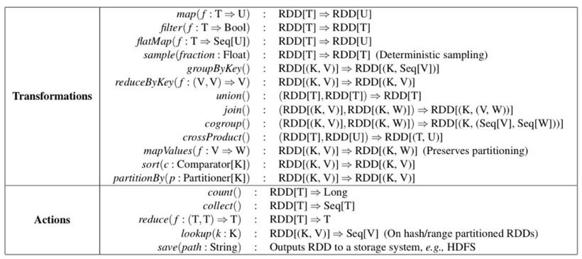
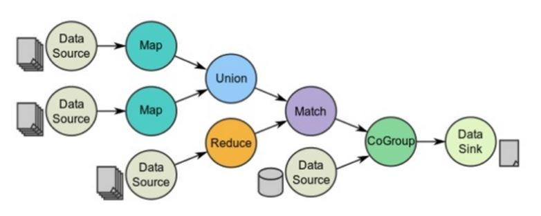
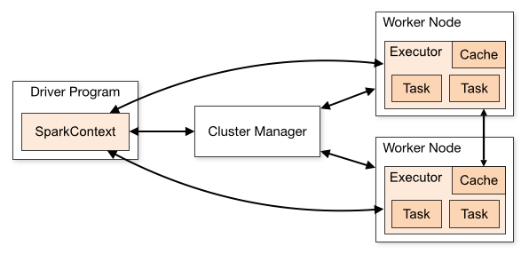
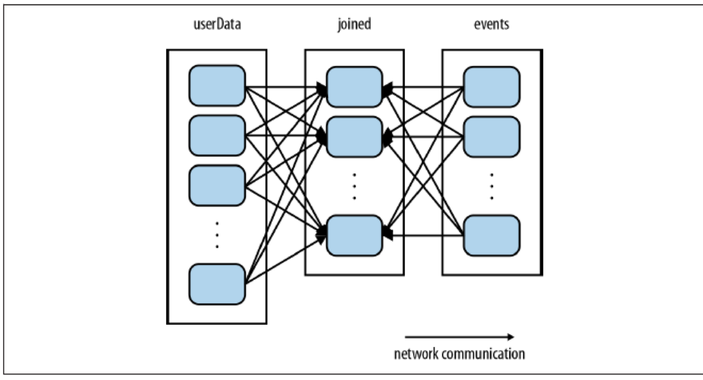
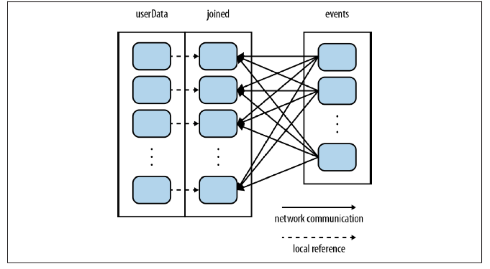

# Basic Concepts in Spark
## 1. RDD Concept

#### Mapreduce is deficient in:

* **Iterative jobs**: frequent in machine learning algorithms to apply a function repeatedly to the same dataset to optimize a parameter. While each iteration can be expressed as a MapReduce job, each job must reload the data from disk, incurring a significant performance penalty.

* **Interactive analytics**: ad-hoc exploratory queries on large datasets. A users would be able to load a dataset of interest into memory across a number of machines and query it repeatedly. However, with Hadoop, each query incurs significant latency (tens of seconds) because it runs as a separate MapReduce job and reads data from disk.

* **Stong points of MapReduce**: Scalability in parallel node processing, and fault-tolerance

#### RDD(Resilient Distributed Datasets)

* a read-only collection of objects partitioned across a set of machines that can be rebuilt if a partition is lost.
* If you need to change an existing RDD you need to create a new RDD. 
* Users can explicitly cache an RDD in memory across machines and reuse it in multiple MapReduce-like parallel operations.
* A higly restricted form of shared memory: read-only, partitioned collections records that can only be created through deterministic transformations (e.g., map, join and group-by) on other RDDs, which allows for low-overhead fault tolerance.
* RDDs achieve fault tolerance through a notion of lineage: if a partition of an RDD is lost, the RDD has enough information about how it was derived from other RDDs to be able to rebuild just that partition.
* The elements of an RDD need not exist in physical storage; instead, a handle to an RDD contains enough information to compute the RDD starting from data in reliable storage. This means that RDDs can always be reconstructed if nodes fail.
* Partitions of a dataset are materialized on demand when they are used in a parallel operation (e.g., by passing a block of a file through a map function), and are discarded from memory after use. 

#### Two operations on RDD

* Transformation: create a new RDD transformed from existing RDD(s) 
* Action: compute a result (not an RDD) from existing RDD(s) or save as file, etc.



#### How to construct RDDs

* From a file in a shared file system, such as the Hadoop Distributed File System (HDFS).
* By “parallelizing” a Scala collection (e.g., an array) in the driver program, which means dividing it into a number of slices that will be sent to multiple nodes.
* By transforming an existing RDD. 
* By changing the persistence of an existing RDD, which are lazy and ephemeral, by default.


#### Fault-tolerance of RDD

* In contrast to distributed shared memory systems, which require costly checkpointing and rollback, RDDs reconstruct lost partitions through lineage: an RDD has enough information about how it was derived from other RDDs to rebuild just the missing partition, without having to checkpoint any data, because they are read-only.
* the lineage: the series of transformations used to build an RDD for recovering lost partitions.

#### Directed acyclic graph(DAG) design: Lazy loading

* Coding is not real computation work, but designing the lineage with DAG.



#### Apache Spark Cluster



1. SparkContext accesses Cluster Manager. Cluster Manager can be the cluster manager of Spark itself or Mesos,YARN. SparkContext is assigned available Executers by cluster manager.
2. SparkContext sends code to the assgined Excutors.
3. Each Excutor performs logics in Task.


#### Concept of Functional programming

* Functional programming has its roots in lambda calculus. The λ-calculus incorporates two simplifications that make this semantics simple. The first simplification is that the λ-calculus treats functions "anonymously", without giving them explicit names. The second simplification is that the λ-calculus only uses functions of a single input.

* Higher-order functions: functions that can either take other functions as arguments or return them as results.
* Pure functions (or expressions): have no side effects (memory or I/O). They are thread-safe, and allow parallel computations.
* Recursion: Iteration (looping) in functional languages is usually accomplished via recursion.
* Anonymous function: Scala provides a relatively lightweight syntax for defining anonymous functions. The following expression creates a successor function for integers:

```scala
(x: Int) => x + 1
```

This is a shorthand for the following anonymous class definition:

```
new Function1[Int, Int] {
  def apply(x: Int): Int = x + 1
}
```

It is also possible to define functions with multiple parameters:

```
(x: Int, y: Int) => "(" + x + ", " + y + ")"
```

or with no parameter:

```
() => { System.getProperty("user.dir") }
```

## 2. Controlling RDD Partitioning among nodes (Ch.4)

#### Explicit Partitioning

* Operations that benefit from partitioning: Many of Spark’s operations involve shuffling data by key across the network. All of these will benefit from partitioning. The operations that benefit from partitioning are cogroup(), groupWith(), join(), leftOuterJoin(), rightOuter Join(), groupByKey(), reduceByKey(), combineByKey(), and lookup().




```scala
val sc = new SparkContext(...)
val userData = sc.sequenceFile[UserID, UserInfo]("hdfs://...")
.partitionBy(new HashPartitioner(100)) // Create 100 partitions .persist()
```
#### Meaning of Parallelize
* Make a parallel collection of data created for parallel processing at distributed nodes
* .parallelize() generates an RDD (a method to create RDDs)
