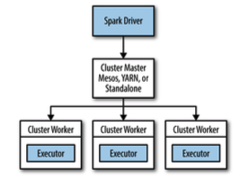
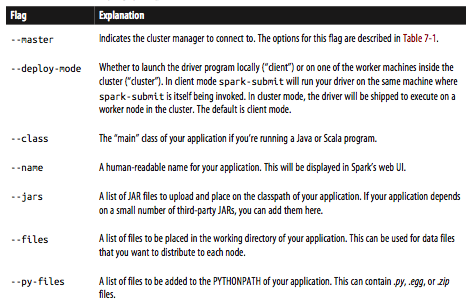
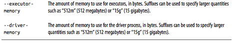
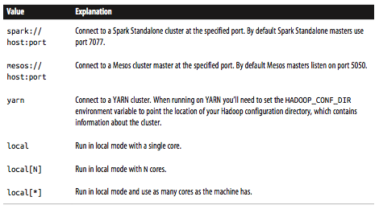

### Spark Runtime Architecture
#### The component of a distributed park application

#### The Driver
*  the process where the main() method of your program runs
*  the process running the user code that creates a SparkContext, creates RDDs, and per‐ forms transformations and actions

##### Two duties
* *Converting a user program into tasks:* The Spark driver is responsible for converting a user program into units of physical execution called tasks. A Spark program implicitly creates a logical directed acyclic graph (DAG) of operations. When the driver runs, it converts this logical graph into a physical execution plan. Spark performs several optimizations, such as “pipelining” map transformations together to merge them, and converts the execution graph into a set of stages. Each stage, in turn, consists of multiple tasks.

* *scheduling tasks on executors:* The Spark driver will look at the current set of executors and try to schedule each task in an appropriate location, based on data placement.

#### Executors

* Worker processes responsible for running the individual tasks in a given Spark job

#### Cluster Manager

* The terms master and worker are used to describe the centralized and distributed portions of the cluster manager.

### Launching a Program

##### The steps that occur when you run a Spark application on a cluster

1. The user submits an application using `spark-submit`.
2. spark-submit launches the driver program and invokes the `main()` method specified by the user.
3. The driver program contacts the cluster manager to ask for resources to launch executors.
4. The cluster manager launches executors on behalf of the driver program.
5. The driver process runs through the user application. Based on the RDD actions and transformations in the program, the driver sends work to executors in the form of tasks.
6. Tasks are run on executor processes to compute and save results.
7. If the driver’s `main()` method exits or it calls `SparkContext.stop()`, it will terminate the executors and release resources from the cluster manager.

#### Some Spark Launching Commands Information
##### `./bin`
* `spark-shell`: calls `spark-submit` with default configuration 
* `spark-submit`: for standalone applications, calls `spark-class`
* `spark-class`: calls `java` with Spark jars

##### `./sbin`
* `spark-daemon.sh`: runs a Spark command (like the followings) as a daemon (run `spark-class` or `spark-submit`)
* specific commands: `start-master.sh`, `stop-master.sh`, `start-slave.sh`, `start-slaves.sh`, `stop-slave.sh`, `stop-slaves.sh`

---
### Deploying Applications with `spark-submit`

#### Submitting to a Spark Standalone cluster

##### general format for `spark-submit`

```
bin/spark-submit [options] <app jar | python file> [app options]
```

* `[options]`: a list of flags for spark-submit.
* `[app options]`: options that will be passed onto your application.
* coomon flags for `spark-submit`





* Possible values for the `--master`



* Example: Using spark-submit with various options

```
# Submitting a Java application to Standalone cluster mode
$ ./bin/spark-submit \
  --master spark://hostname:7077 \
  --deploy-mode cluster \
  --class com.databricks.examples.SparkExample \ --name "Example Program" \
  --jars dep1.jar,dep2.jar,dep3.jar \ --total-executor-cores 300 \
  --executor-memory 10g \
  myApp.jar "options" "to your application" "go here"
```

```
# Submitting a Python application in YARN client mode
$ export HADOP_CONF_DIR=/opt/hadoop/conf $ ./bin/spark-submit \
  --master yarn \
  --py-files somelib-1.2.egg,otherlib-4.4.zip,other-file.py \ --deploy-mode client \
  --name "Example Program" \
  --queue exampleQueue \
  --num-executors 40 \
  --executor-memory 10g \
  my_script.py "options" "to your application" "go here"
```
---

### Packaging Your Code and Dependencies

* If your program imports any libraries that are not in the org.apache.spark package or part of the language library, you need to ensure that all your dependencies are present at the runtime of your Spark application.

* uber JAR (assembly JAR): a single large JAR containing the entire transitive dependency graph of an application produced by a build tool, such as Mave (Java) and sbt, simple build tool (Scala)

#### A Java Spark Application Built with Maven

* pom.xml file containing a build definition for a Spark application built with Maven
* This project declares two transitive dependencies: `jopt-simple`, a Java library to perform option parsing, and `joda-time`, a library with utilities for time and date conversion. 

```xml
<project> 
     <modelVersion>4.0.0</modelVersion>
     <!-- Information about your project -->
     <groupId>com.databricks</groupId> 
     <artifactId>example-build</artifactId> 
     <name>Simple Project</name> 
     <packaging>jar</packaging> 
     <version>1.0</version>
  
     <dependencies>
         <!-- Spark dependency -->
         <dependency> 
             <groupId>org.apache.spark</groupId> 
             <artifactId>spark-core_2.10</artifactId> 
             <version>1.2.0</version> 
             <scope>provided</scope>
         </dependency>
         <!-- Third-party library -->
         <dependency> 
             <groupId>net.sf.jopt-simple</groupId> 
             <artifactId>jopt-simple</artifactId> 
             <version>4.3</version>
         </dependency>
         <!-- Third-party library -->
         <dependency> 
             <groupId>joda-time</groupId> 
             <artifactId>joda-time</artifactId> 
             <version>2.0</version>
         </dependency>
     </dependencies>
     <build>
         <plugins>
         <!-- Maven shade plug-in that creates uber JARs -->
             <plugin> 
                 <groupId>org.apache.maven.plugins</groupId> 
                 <artifactId>maven-shade-plugin</artifactId> 
                 <version>2.3</version>
                 <executions>
                     <execution> 
                         <phase>package</phase> 
                         <goals>
                             <goal>shade</goal> 
                         </goals>
                     </execution>
                 </executions>
             </plugin>
         </plugins>
     </build>
</project>
```

* Packaging a Spark application built with Maven
 
```
$ mvn package
# In the target directory, we'll see an uber JAR and the original package JAR
$ ls target/
example-build-1.0.jar
original-example-build-1.0.jar
# Listing the uber JAR will reveal classes from dependency libraries
$ jar tf target/example-build-1.0.jar
...
joptsimple/HelpFormatter.class
...
org/joda/time/tz/UTCProvider.class
...
# An uber JAR can be passed directly to spark-submit
$ /path/to/spark/bin/spark-submit --master local ... target/example-build-1.0.jar
```

#### A Scala Spark Application Built with sbt

* At the root of your project you create a build file called build.sbt
* Your source code is expected to live in src/main/scala
* Example build.sbt file for a Spark application built with sbt 0.13

```
import AssemblyKeys._

name := "Simple Project" 

version := "1.0"

organization := "com.databricks" 

scalaVersion := "2.10.3"

libraryDependencies ++= Seq(
    // Spark dependency
    "org.apache.spark" % "spark-core_2.10" % "1.2.0" % "provided", 
    // Third-party libraries
    "net.sf.jopt-simple" % "jopt-simple" % "4.3",
    "joda-time" % "joda-time" % "2.0"
)

// This statement includes the assembly plug-in capabilities
assemblySettings

// Configure JAR used with the assembly plug-in
jarName in assembly := "my-project-assembly.jar"

// A special option to exclude Scala itself form our assembly JAR, since Spark 
// already bundles Scala.
assemblyOption in assembly :=
    (assemblyOption in assembly).value.copy(includeScala = false)
```

* `assembly.sbt`: lists the dependency on the plug-in in a project/ directory 

```
# Display contents of project/assembly.sbt
$ cat project/assembly.sbt
addSbtPlugin("com.eed3si9n" % "sbt-assembly" % "0.11.2")
```

* Packaging a Spark application built with sbt (sbt assembly) 

```shell
$ sbt assembly
# In the target directory, we'll see an assembly JAR
$ ls target/scala-2.10/
my-project-assembly.jar
# Listing the assembly JAR will reveal classes from dependency libraries $ jar tf target/scala-2.10/my-project-assembly.jar
...
joptsimple/HelpFormatter.class
...
org/joda/time/tz/UTCProvider.class
...
# An assembly JAR can be passed directly to spark-submit
$ /path/to/spark/bin/spark-submit --master local ...
  target/scala-2.10/my-project-assembly.jar
```

### Cluster Managers

#### Standalone Cluster Manager

##### Launching the Standalone cluster manager

* by starting a master and workers by hand, or by using launch scripts in Spark’s sbin directory
* The launch scripts are the simplest but require SSH access between your machines

##### Steps to use the cluster launch scripts

1. Copy a compiled version of Spark to the same location on all your machines—for example, `/home/yourname/spark`.
2. Set up password-less SSH access from your master machine to the others. This requires having the same user account on all the machines, creating a private SSH key for it on the master via `ssh-keygen`, and adding this key to the `.ssh/authorized_keys` file of all the workers. If you have not set this up before, you can follow these commands:

```shell
    # On master: run ssh-keygen accepting default options
    $ ssh-keygen -t dsa
    Enter file in which to save the key (/home/you/.ssh/id_dsa): [ENTER] 
    Enter passphrase (empty for no passphrase): [EMPTY]
    Enter same passphrase again: [EMPTY]

    # On workers:
    # copy ~/.ssh/id_dsa.pub from your master to the worker, then use: 
    $ cat ~/.ssh/id_dsa.pub >> ~/.ssh/authorized_keys
    $ chmod 644 ~/.ssh/authorized_keys
```

3. Edit the `conf/slaves` file on your master and fill in the workers’ hostnames.
4. To start the cluster, run sbin/start-all.sh on your master (it is important to run it there rather than on a worker). If everything started, you should get no prompts for a password, and the cluster manager’s web UI should appear at `http://masternode:8080` and show all your workers.
5. To stop the cluster, run bin/stop-all.sh on your master node.

##### Launching the cluster manually (non-UNIX system)

* On the master
 
```shell
bin/spark-class org.apache.spark.deploy.master.Master
```

* On workers
 
```shell
bin/spark-class org.apache.spark.deploy.worker.Worker spark://masternode:7077
```

#### Submitting applications to the Standalone cluster manager

```shell
spark-submit --master spark://masternode:7077 yourapp
```

#### Using `spark-shell` or `pyspark`

```shell
    spark-shell --master spark://masternode:7077
    pyspark --master spark://masternode:7077
```

#### Starting a Cluster Manually

You can start a standalone master server by executing:

```shell
./sbin/start-master.sh
```

You can start one or more workers and connect them to the master via:

```shell
./sbin/start-slave.sh <master-spark-URL>
```

The following configuration options can be passed to the master and worker:

Argument	    | Meaning
--------------|--------
`-h HOST`, `--host HOST`	| Hostname to listen on
`-i HOST`, `--ip HOST`	| Hostname to listen on (deprecated, use -h or --host)
`-p PORT`, `--port PORT`	|Port for service to listen on (default: 7077 for master, random for worker)
`--webui-port PORT`	|Port for web UI (default: 8080 for master, 8081 for worker)
`-c CORES`, `--cores CORES`	 |Total CPU cores to allow Spark applications to use on the machine (default: all available); only on worker
`-m MEM`, `--memory MEM`	| Total amount of memory to allow Spark applications to use on the machine, in a format like 1000M or 2G (default: your machine's total RAM minus 1 GB); only on worker
`-d DIR`, `--work-dir DIR`	|Directory to use for scratch space and job output logs (default: SPARK_HOME/work); only on worker
`--properties-file FILE`	|Path to a custom Spark properties file to load (default: conf/spark-defaults.conf)

#### Connecting an Application to the Cluster

To run an interactive Spark shell against the cluster, run the following command:

```shell
./bin/spark-shell --master spark://IP:PORT
```

#### deploy modes of spark-submit

* client mode (default): The driver runs on the machine where you executed spark-submit, as part of the spark-submit command. You can directly see the output of your driver program, or send input to it (e.g., for an interactive shell)
* cluster mode: The driver is launched within the Standalone cluster. You will still be able to access logs for the application through the cluster manager’s web UI

### Hadoop YARN

YARN is a cluster manager introduced in Hadoop 2.0, and is typically installed on the same nodes as the Hadoop filesystem (HDFS). Running Spark on YARN in these environments is useful because it lets Spark access HDFS data quickly, on the same nodes where the data is stored.

### Apache Mesos

Apache Mesos is a general-purpose cluster manager that can run both analytics workloads and long-running services (e.g., web applications or key/value stores) on a cluster

### Amazon EC2

Spark comes with a built-in script to launch clusters on Amazon EC2. This script launches a set of nodes and then installs the Standalone cluster manager on them, so once the cluster is up, you can use it according to the Standalone mode instructions in the previous section.

### Which Cluster Manager to Use?

* Start with a Standalone cluster if this is a new deployment. 
* If you would like to run Spark alongside other applications, or to use richer resource scheduling capabilities (e.g., queues), both YARN and Mesos provide these features. 
* One advantage of Mesos over both YARN and Standalone mode is its fine- grained sharing option, which lets interactive applications such as the Spark shell scale down their CPU allocation between commands. 
* In all cases, it is best to run Spark on the same nodes as HDFS for fast access to storage.

